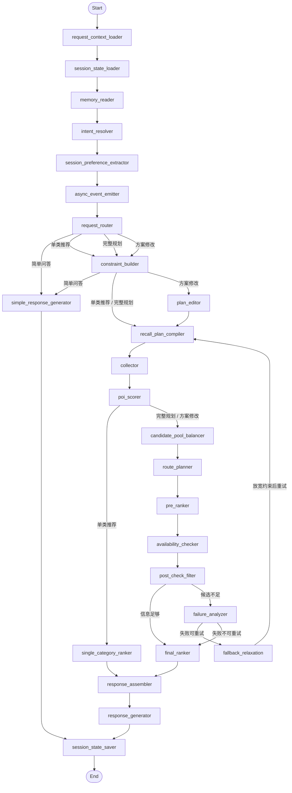

# LifeRouteAgent

<p align="center">
  <sub><strong>LOCAL LIFE AGENT</strong> · <strong>AI WEEKEND PLANNER</strong></sub>
</p>

<h1 align="center">PlanGo — AI 本地生活规划师</h1>

<p align="center">
  一句话输入，AI 自动规划吃喝玩乐完整方案，完成 POI 召回、路线组合、可用性检查与失败回退。
</p>

<p align="center">
  <a href="http://[2001:da8:215:3c02:c2a4:230f:3cf2:5413]:5173">在线 Demo</a>
  ·
  <a href="docs/PlanGo.pdf">设计文档</a>
</p>

<p align="center">
  
  
  
  
  
  
</p>

## 1. 项目简介

PlanGo 是一个面向本地生活场景的智能规划 Agent 系统，重点解决周末、下午、晚上等闲时活动规划问题。用户可以用自然语言提出需求，例如“今天下午想和老婆孩子出去玩几个小时，别太远”，系统会自动理解出行场景、时间、距离、预算、人群偏好等约束，并生成包含活动、餐饮、路线、预算、时间线和风险提示的可执行方案。

它不是普通的 CRUD 项目，也不是简单的 POI 搜索或关键词推荐。项目核心是一个 Planning Graph 工作流：把用户输入拆解成意图、约束、召回计划、候选 POI、路线组合、可用性检查、方案排序和最终解释，帮助用户完成“一套能直接执行的本地生活方案”。

当前项目主要面向北京本地生活数据。其他城市在前端和兼容接口中有占位展示，但真实 POI 数据和规划能力以当前数据库中导入的数据为准。

## 2. 核心功能

- 自然语言规划请求：支持通过 `/trip/plan` 和 `/trip/plan/stream` 输入自然语言需求，后端自动进入 Planning Graph。
- 多轮上下文理解：通过 `SessionStore`、`ContextManager`、`PlanningState.context` 保存最近会话、上一轮方案、结构化摘要和当前关注点。
- 方案修改 / revise：`/trip/plan/revise/stream` 会复用同一 session 的历史方案和上下文，进入 `plan_adjustment` 分支。
- POI 多类型召回：支持 restaurant、activity、attraction、shopping、entertainment、fitness、beauty 七类本地生活 POI。
- POI 候选打分：`scoring_service` 根据距离、标签、关键词、质量、长期偏好和风险扣分生成 `final_poi_score`。
- 候选池平衡：`candidate_pool_balancer` 控制不同类别、价格带、距离带的候选分布，避免同质化。
- 路线组合：`routing_service` 将不同 slot 的 POI 组合成候选方案，并计算时间线、路线距离、交通耗时和预算。
- 高德路线增强：`AmapRouteService` 可调用高德路线接口；不可用时回退 Haversine 距离估算。
- 方案排序：`ranking_service` 根据偏好匹配、距离、预算、时间可行性、热度、多样性和 memory fit 对方案排序。
- 营业 / 预约 / 风险检查：`availability_service` 当前使用 POI 字段和 mock 规则检查营业未知、关闭、预约不可用、排队风险。
- 失败回退：当召回、路线或可用性不足时，`failure_analyzer` 会识别原因，`fallback_relaxation` 会放宽距离、评分、标签或时长约束后重试。
- SSE 流式进度输出：流式接口输出 `status`、`agent_thinking`、`node_update`、`response_chunk`、`final`、`done` 等事件。
- Trace / Debug：运行过程通过 event bus、trace recorder、runtime store 记录节点事件、运行指标和 trace，可通过观测接口读取。
- 方案导出：支持 PDF 导出、PDF 预渲染缓存、ICS 日历导出。
- Memory 异步提取：用户输入、方案收藏/导出/执行等行为会通过 `MemoryEventQueue` 异步沉淀长期偏好。
- 前端方案展示：React 前端提供聊天入口、方案概览、详情、地图、路线、导出和观测面板。

## 3. 技术栈

后端：

- Python 3.12
- FastAPI
- LangGraph
- Pydantic
- PyMySQL / MySQL
- ReportLab PDF
- HTTPX
- SSE Streaming
- kafka-python：当前为可配置异步 memory 队列通道，默认关闭并使用本地后台线程 fallback。
- pymilvus / sentence-transformers：用于向量记忆和相似画像检索；当前是可选增强层，不是主流程必需。
- Redis：Docker Compose 已配置，当前主要作为部署预留和后续缓存/上下文存储入口；当前代码主存储仍是 MySQL runtime store + 文件 fallback。
- ES：当前未实现。

前端：

- React
- TypeScript
- Vite
- lucide-react
- 原生 CSS
- 主要页面和组件位于 `frontend/src/pages`、`frontend/src/components`、`frontend/src/api`、`frontend/src/hooks`。

基础设施：

- Docker Compose
- MySQL 初始化 SQL：`database/sql`
- Runtime / Memory 表初始化脚本：`backend/scripts/init_runtime_schema.py`
- 测试框架：pytest，测试目录为 `backend/tests`
- 前端生产构建：`npm run build`

## 4. 系统架构

文字版架构：

```text
用户请求
  ↓
FastAPI API Layer
  ├── /trip/*
  ├── /api/* compatibility
  ├── /api/plans progress stream
  └── /export/*
  ↓
TripPlanningService / TripStreamingService / TripRevisionService
  ↓
Planning Graph
  ├── Context Nodes
  ├── Intent Nodes
  ├── Constraint Nodes
  ├── Recall Nodes
  ├── Candidate Nodes
  ├── Planning Nodes
  ├── Validation Nodes
  ├── Response Nodes
  └── Session Nodes
  ↓
PlanningState
  ↓
SSE / JSON Response
  ↓
React Frontend
```

分层说明：

- API 层负责请求入口、响应模型、SSE 包装、导出和兼容接口。
- Planning Graph 负责编排节点执行顺序、条件分支和失败回退。
- Nodes 负责读写 `PlanningState`，保持节点输入输出结构化。
- Services 负责具体业务逻辑，例如约束构建、召回、打分、路线、排序、响应组装。
- LLM Agents 负责语义理解、会话摘要、Memory 提取和最终文案生成；LLM 不直接控制主流程。
- Memory 负责长期偏好、负向反馈、行为反馈和相似画像依据，作为软偏好参与打分和排序。
- Trace / Runtime Store 负责可观测性、任务状态、会话状态、工具缓存和节点指标。

## 5. Planning Graph 流程

当前主流程定义在 `backend/app/planning/graph_builder.py`。节点名称如下：

1. `request_context_loader`
   加载当前用户输入、session/user 元信息、城市、浏览器定位、手动起点和 POI 标签目录。

2. `session_state_loader`
   从 `SessionStore` 读取 session 历史、最近轮次、上一轮方案和结构化 session summary，并写入 `PlanningState.context`。

3. `memory_reader`
   读取长期用户偏好、正负向标签、相似画像摘要，注入 `user_preference_profile` 和 `prompt_context_pack`。

4. `intent_resolver`
   使用规则 + LLM 理解用户意图、目标类别、场景、slot 和初步约束。

5. `session_preference_extractor`
   同步抽取当前请求需要立即使用的会话偏好，包括场景、同行人结构、活动偏好、餐饮偏好、路线偏好、硬约束、软偏好和负向偏好。

6. `async_event_emitter`
   把用户 query 投递到异步 Memory 队列，不阻塞当前规划响应。

7. `request_router`
   将请求分为 `simple_qa`、`single_category_recommend`、`full_itinerary_plan`、`plan_adjustment`。

8. `constraint_builder`
   合并当前请求、同步会话偏好、默认策略、历史上下文和长期 Memory 软偏好，生成最终约束。

9. `plan_editor`
   方案修改分支使用，基于上一轮方案和用户修改意图生成调整目标。

10. `recall_plan_compiler`
    将逻辑召回需求编译成可执行的安全召回计划。

11. `collector`
    通过 `PoiRepository` 查询 MySQL POI 表，生成原始候选。

12. `poi_scorer`
    对每个 slot 的候选 POI 打分，并保留 score breakdown、原因和 warning。

13. `single_category_ranker`
    单类推荐分支使用，直接排序候选并进入响应组装。

14. `candidate_pool_balancer`
    完整规划和方案调整分支使用，控制候选池规模和多样性。

15. `route_planner`
    组合活动、餐饮、购物、娱乐等 slot，生成候选方案、路线摘要、预算摘要和 timeline。

16. `pre_ranker`
    对初步方案进行预排序，减少后续检查压力。

17. `availability_checker`
    检查营业、预约、排队等可用性风险，过滤明显不可执行方案。

18. `post_check_filter`
    判断可用方案是否足够；足够则进入最终排序，不足则进入失败分析。

19. `failure_analyzer`
    分析失败原因，例如 slot 候选不足、标签过严、路线不可行、可用性失败。

20. `fallback_relaxation`
    根据失败原因放宽半径、评分、标签、预算或时长约束，然后回到 `recall_plan_compiler` 重试。

21. `final_ranker`
    生成最终候选方案排序。

22. `response_assembler`
    组装面向前端的结构化 payload。

23. `response_generator`
    生成自然语言解释和最终回答。

24. `simple_response_generator`
    简单问答分支使用，不进入 POI 召回和路线规划。

25. `session_state_saver`
    保存当前轮 session、latest planning state、latest response 和 session summary。

Agent 工作流编排图：



## 6. 上下文管理设计

上下文相关实现主要位于：

- `backend/app/context/context_manager.py`
- `backend/app/context/session_store.py`
- `backend/app/planning/nodes/context_nodes.py`
- `backend/app/planning/state/context.py`

### 6.1 当前请求上下文

当前请求上下文包括：

- 当前用户输入 `raw_user_input`
- `session_id` / `user_id` / `request_id` / `message_id`
- 城市
- `geo_location`
- `manual_origin`
- 当前同步抽取的 `SessionPreferenceProfile`
- 当前构建出的 `FinalConstraints`
- 本轮 POI 标签目录 `poi_logical_tag_catalog`

这层上下文优先级最高。当前请求里的明确硬约束会优先进入 constraint builder、recall、scorer、route planner 和 response generator，不依赖异步 Memory。

### 6.2 会话上下文

会话上下文包括：

- `recent_turns`
- `session_summary`
- `current_plan_state`
- `last_ranked_plans`
- `last_constraints_snapshot`
- `active_constraints`
- `negative_constraints`
- `current_focus`
- `last_plan_ids`
- `open_questions`

`SessionStore.save_turn()` 会保存最近 30 轮会话摘要和最新规划状态。`ContextManager.recent_turns()` 当前最多读取最近 5 轮用户输入，用于多轮理解和方案修改。`ContextManager.session_summary()` 会生成结构化 JSON + 简短 summary，而不是只保存自然语言摘要。

### 6.3 长期记忆上下文

长期记忆上下文包括：

- 用户长期偏好
- disliked keywords
- favorite categories
- positive / negative memory tags
- similar user preferences
- profile cluster
- memory snippets

长期 Memory 只作为软偏好参与规划，不覆盖当前用户明确请求。当前请求硬约束优先级高于当前软偏好，长期 Memory 和相似用户偏好只影响 scorer / ranker 的轻量加权和解释。

### 6.4 上下文压缩策略

当前实现：

- session 存储最多保留最近 30 轮 `turns`。
- 当前请求注入最近最多 5 轮 `recent_turns`。
- `recent_turns > 8`、已有完整规划结果、或用户开始修改方案时，会触发 `session_summary` 更新。
- `session_summary` 是结构化 JSON + 简短自然语言 summary，包含 active constraints、negative constraints、resolved references、current focus、last plan ids、open questions。
- summary 更新优先调用 `session_summary_agent.compress_session_summary()`，失败时回退规则摘要。
- `prompt_context_pack` 会估算 token，预算为约 6000 tokens。
- 如果超过预算，会裁剪 recent turns 到最近 3 轮、Memory 正负向标签各 6 个、相似画像 2 个、last plan ids 3 个。
- response payload 会在 response assembly / frontend compatibility 阶段做结构化输出，避免把所有内部状态直接塞给前端。
- Memory context 默认 top-k 读取，`build_memory_context()` 默认 limit 为 5，positive/negative tags 注入 prompt pack 时各最多 12 个。

当前主要依赖轮次截断、结构化摘要和 top-k 裁剪；已经有基于 JSON 长度的 token 估算裁剪，但暂未实现严格 tokenizer 级 token 预算控制。

## 7. Memory 设计

Memory 的定位不是简单保存聊天记录，而是沉淀长期偏好、避雷信息、行为反馈和个性化排序依据。它不覆盖当前请求，只作为 scorer / ranker 的软偏好和解释依据。

相关模块：

- `backend/app/memory/memory_service.py`
  混合长期记忆服务，负责画像读取、query 观察、方案反馈、相似用户画像搜索、向量索引重建。

- `backend/app/memory/memory_store.py`
  文件型 MemoryStore，保存用户画像、会话 memory、工具缓存接口；工具缓存实际通过 runtime store 写入。

- `backend/app/memory/memory_event_queue.py`
  异步事件队列。Kafka 开启时会尝试写入 Kafka；默认 `KAFKA_ENABLED=false`，使用本地后台线程处理。

- `backend/app/memory/event_processor.py`
  处理 `user_query_observed` 和 `plan_feedback_observed` 事件。

- `backend/app/memory/write_service.py` / `read_service.py`
  Memory 读写门面，供 API 和事件处理器调用。

- `backend/app/agents/memory_extractor_agent.py`
  使用 LLM 提取长期偏好更新；低置信度、临时需求或敏感信息不会写入长期画像。

- `backend/app/memory/vector_memory_store.py`
  Milvus 向量记忆层。当前为可选增强能力；不可用时回退文件搜索。

当前已实现：

- 用户 query 异步观察。
- 方案保存、收藏、导出 PDF、导出日历、选择、执行等阶段反馈写入 Memory。
- 不同行为阶段有不同权重：`plan_selected=1.6`，`plan_executed=2.2`，导出 PDF/日历为 `1.1`。
- LLM 提取长期偏好时要求 `scope=long_term` 且 confidence 不低于 `0.65`。
- Memory 文件保存在 runtime memory 目录下，session/runtime 状态优先使用 MySQL，失败时回退文件。
- 初始化脚本已包含 memory 相关 MySQL 表 DDL，但当前 MemoryService 主体仍以文件画像 + 可选向量库为主；MySQL memory 表属于后续结构化持久化升级方向。

## 8. POI 召回与打分

当前支持的 POI 类型定义在 `backend/app/planning/state/base.py`：

| Logical Category | Physical Table |
|---|---|
| restaurant | `poi_restaurant` |
| activity | `poi_activities` |
| attraction | `poi_attractions` |
| shopping | `poi_shoppings` |
| entertainment | `poi_entertainment` |
| fitness | `poi_fitness` |
| beauty | `poi_beauty` |

召回相关实现：

- `backend/app/repositories/poi_repository.py`
- `backend/app/planning/services/recall_service.py`
- `backend/app/planning/nodes/recall_nodes.py`
- `backend/app/planning/poi_catalog_service.py`

POI 打分实现：

- `backend/app/planning/scoring_service.py`
- `backend/app/planning/services/candidate_service.py`
- `backend/app/planning/nodes/candidate_nodes.py`

真实 POI 评分权重：

| 因子 | 权重 / 规则 |
|---|---|
| 距离 | `0.30` |
| 逻辑标签匹配 | `0.30` |
| 关键词匹配 | `0.30` |
| 质量 / rating | `0.10` |
| Memory 匹配 | `memory_score * 5.0` 小幅加分 |
| 风险扣分 | `risk_penalty * 100.0` |

风险扣分包括价格未知、经纬度缺失等。低于评分下限的非 must include POI 会被过滤。

方案排序权重位于 `ranking_service.rank_route_plans()`：

| 因子 | 权重 |
|---|---|
| preference_match | `0.28` |
| distance_reasonable | `0.18` |
| budget_fit | `0.14` |
| time_feasible | `0.14` |
| rating_heat | `0.12` |
| diversity_bonus | `0.08` |
| memory_fit | `0.06` |
| warning_penalty | `-20 * warning_penalty` |

## 9. API 接口

核心接口来自 `backend/app/api/main.py` 和 `backend/app/api/routes`：

| Method | Path | 说明 |
|---|---|---|
| GET | `/health` | 后端健康检查 |
| GET | `/trip/client-config` | 前端客户端配置，当前返回高德 key |
| POST | `/trip/plan` | 普通非流式规划 |
| POST | `/trip/plan/stream` | SSE 流式规划 |
| POST | `/trip/plan/revise/stream` | 基于 session 的流式方案修改 |
| POST | `/trip/plan/adjust` | 兼容旧前端的单个 POI 替换 |
| POST | `/trip/execute/stream` | 模拟执行方案，并异步写入 plan feedback memory |
| POST | `/trip/calendar/ics` | 导出 ICS 日历文件 |
| GET | `/trip/trace/{trace_id}` | 读取 trace 事件 |
| GET | `/trip/task/{task_id}` | 读取 checkpoint task |
| POST | `/trip/task/{task_id}/resume` | 恢复任务决策 |
| GET | `/trip/task/{task_id}/resume-decision` | 查询恢复决策 |
| GET | `/trip/evals/runtime-summary` | Runtime 评测摘要 |
| GET | `/trip/observability/node-metrics` | 节点指标，可按 trace_id 查询 |
| GET | `/trip/observability/runtime-health` | runtime store 健康状态 |
| DELETE | `/trip/memory` | 清空用户 Memory |
| GET | `/trip/memory/search` | 搜索 Memory |
| GET | `/trip/memory/profile` | 获取用户画像和向量记忆状态 |
| POST | `/trip/memory/rebuild-index` | 重建向量记忆索引 |
| GET | `/trip/memory/clusters` | 查看 Memory 聚类结果 |
| GET | `/trip/data-source` | 查看 POI 数据源状态 |
| POST | `/api/plans` | 创建后台规划任务并返回 progress stream URL |
| GET | `/api/plans/{request_id}/stream` | 读取后台规划进度 SSE |
| POST | `/export/plan/pdf/prepare` | 预渲染 PDF，返回 token |
| GET | `/export/plan/pdf/{token}` | 下载预渲染 PDF |
| POST | `/export/plan/pdf` | 直接导出 PDF |
| GET | `/export/health` | 导出服务健康检查 |
| GET | `/api/cities` | 兼容接口，城市列表 |
| GET | `/api/user/profile` | 兼容接口，读取用户画像 |
| GET | `/api/home/inspirations` | 首页灵感 POI |
| GET | `/api/home/weather` | 首页天气 |
| POST | `/api/plan-stream` | 兼容旧前端的流式规划入口 |
| POST | `/api/plans/{plan_id}/{action}` | 兼容保存、收藏、分享、日历、导航等轻量动作 |

Mock 执行动作接口：

| Method | Path | 说明 |
|---|---|---|
| POST | `/api/mock/restaurant-booking` | mock 餐厅预约 |
| POST | `/api/mock/ticket-reservation` | mock 票务预约 |
| POST | `/api/mock/taxi-dispatch` | mock 打车 |
| POST | `/api/mock/calendar-event` | mock 日历事件 |

## 10. 快速开始

### 10.1 克隆项目

```powershell
git clone https://github.com/LifeRouteAgent/PlanGo.git
cd PlanGo
```

如果你已经在本机目录中：

```powershell
cd C:\Users\dengp\project\LifeRouteAgent
```

### 10.2 配置后端

后端配置入口为 `backend/app/config.py`，读取优先级：

1. `LIFEROUTE_CONFIG_PATH`
2. `backend/config.local.json`
3. `backend/config.example.json`

本地开发建议复制配置：

```powershell
Copy-Item backend\config.example.json backend\config.local.json
```

然后按需填写：

- `DEEPSEEK_API_KEY`
- `DEEPSEEK_BASE_URL`
- `DEEPSEEK_MODEL`
- `AMAP_API_KEY`
- `DATABASE_HOST`
- `DATABASE_PASSWORD`
- `MILVUS_ENABLED`
- `REDIS_URL`

### 10.3 安装后端依赖

```powershell
python -m venv .venv
.\.venv\Scripts\pip.exe install -r backend\requirements.txt
```

### 10.4 启动基础服务

如果使用 Docker Compose：

```powershell
Copy-Item .env.example .env
docker compose up -d mysql redis etcd minio milvus
```

请在 `.env` 中至少配置：

```env
MYSQL_ROOT_PASSWORD=your-password
MINIO_SECRET_KEY=your-minio-secret
DEEPSEEK_API_KEY=your-deepseek-key
AMAP_API_KEY=your-amap-key
AMAP_SECURITY_JS_CODE=your-amap-js-security-code
```

如果不使用 Docker，请根据实际环境准备 MySQL，并导入 `database/sql` 下的 POI 表。

### 10.5 初始化 runtime / memory 表

```powershell
cd backend
..\.venv\Scripts\python.exe scripts\init_runtime_schema.py
```

该脚本会创建：

- `runtime_sessions`
- `runtime_tasks`
- `runtime_tool_cache`
- `runtime_trace_events`
- `runtime_node_metrics`
- `memory_user_profiles`
- `memory_preferences`
- `memory_evidence`
- `memory_events`
- `memory_plan_feedback`
- `memory_session_turns`
- `memory_rejected_plans`

### 10.6 启动后端

```powershell
cd C:\Users\dengp\project\LifeRouteAgent\backend
..\.venv\Scripts\python.exe -m uvicorn app.api.main:app --host 127.0.0.1 --port 8000
```

访问：

```text
http://127.0.0.1:8000/health
http://127.0.0.1:8000/docs
```

### 10.7 启动前端

```powershell
cd C:\Users\dengp\project\LifeRouteAgent\frontend
npm install
npm run dev -- --host 127.0.0.1 --port 5173
```

访问：

```text
http://127.0.0.1:5173
```

### 10.8 一键 Docker 部署

完整部署说明见 `docs/DEPLOYMENT.md`。

```powershell
Copy-Item .env.example .env
docker compose up -d --build
```

Docker 服务：

- Frontend: `http://127.0.0.1:5173`
- Backend: `http://127.0.0.1:8000`
- MySQL: `127.0.0.1:3306`
- Redis: `127.0.0.1:6379`
- Milvus: `127.0.0.1:19530`
- MinIO Console: `http://127.0.0.1:9001`

## 11. 配置说明

主要配置文件：

| 文件 | 说明 |
|---|---|
| `.env.example` | Docker Compose 部署变量示例 |
| `backend/config.example.json` | 后端本地配置模板 |
| `backend/config.docker.json` | 后端容器配置模板 |
| `backend/.env.example` | 后端本地 env 字段参考 |
| `frontend/.env.example` | 前端 Vite 本地开发 env 字段参考 |
| `frontend/docker-entrypoint.sh` | Docker 前端启动时生成 `/app-config.json` |

大模型 API：

```env
DEEPSEEK_API_KEY=
DEEPSEEK_BASE_URL=https://api.deepseek.com
DEEPSEEK_MODEL=deepseek-v4-pro
DEEPSEEK_REASONING_EFFORT=high
DEEPSEEK_THINKING_ENABLED=false
```

高德地图：

```env
AMAP_API_KEY=
AMAP_SECURITY_JS_CODE=
AMAP_ROUTE_ENABLED=true
```

前端 Docker 运行时会把 `AMAP_API_KEY` 和 `AMAP_SECURITY_JS_CODE` 写入 `/app-config.json`，浏览器启动后从该文件读取地图配置。

## 12. 目录结构

```text
backend/app/api/             FastAPI 入口和 routes
backend/app/api/schemas/     API 请求/响应模型
backend/app/planning/        Planning Graph、nodes、services、state
backend/app/context/         ContextManager、SessionStore
backend/app/memory/          长期记忆、事件队列、向量记忆
backend/app/agents/          LLM intent、response、memory、summary agents
backend/app/prompts/         Prompt 模板
backend/app/repositories/    POI repository
backend/app/integrations/    高德路线、天气、日历、embedding
backend/app/runtime/         runtime store、checkpoint、runtime paths
backend/app/observability/   trace、progress、node metrics
backend/app/export/          PDF / export services
backend/tests/               pytest 测试
database/sql/                七类 POI 表 SQL
frontend/src/api/            前端 API / SSE 客户端
frontend/src/pages/          页面
frontend/src/components/     UI 和业务组件
frontend/src/hooks/          流式规划 hook
docs/                        部署、项目介绍和答辩文档
```

## 13. 测试与校验

后端测试：

```powershell
cd C:\Users\dengp\project\LifeRouteAgent\backend
..\.venv\Scripts\python.exe -m pytest tests -q
```

前端构建：

```powershell
cd C:\Users\dengp\project\LifeRouteAgent\frontend
npm run build
```

数据源检查：

```text
GET http://127.0.0.1:8000/trip/data-source
```

runtime 健康检查：

```text
GET http://127.0.0.1:8000/trip/observability/runtime-health
```
