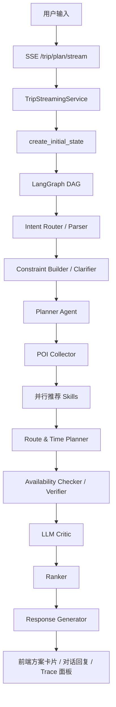

# LifeRouteAgent

LifeRouteAgent 是一个面向本地生活周末活动的 Agentic Planning 项目。它不是简单的 POI 搜索或聊天机器人，而是通过 **FastAPI + LangGraph + MySQL + React**，把自然语言需求拆解成可执行的本地生活方案：召回地点、推荐组合、规划路线、校验预算和时长、生成用户可读解释，并提供 mock 执行、Memory、Trace 和评测能力。

完整项目介绍、代码讲解、答辩稿和 Mermaid 图见：[docs/PROJECT_INTRODUCTION.md](docs/PROJECT_INTRODUCTION.md)。

## 当前能力

- 自然语言理解：区分简单问答、单类推荐和完整规划。
- LangGraph DAG：Intent、Constraint、Planner、Collector、并行 Skill、Route Planner、Verifier、LLM Critic、Ranker、Response。
- 七类 POI：景点、购物、活动、餐厅、健身、娱乐、美容养生。
- 本地 MySQL 数据源：`database/sql` 提供 POI 表 SQL。
- 多 Skill 推荐：活动、餐厅、生活娱乐、景点/商场混合推荐。
- 路线与时间线：生成 `timeline`、`route_segments`、预算和总时长。
- 高德增强：路线和天气接口已接入，失败回退 Haversine/默认天气。
- 流式输出：后端 SSE 推送节点进度、文本片段和最终方案。
- 执行入口：预约、购票、打车为 mock；日历 ICS 和 PDF 导出已实现。
- Memory：文件画像 + 会话记忆 + 可选 Milvus 向量记忆。
- 运行治理：ToolHarness、ToolPolicy、Checkpoint、RuntimeStore、TraceRecorder、Node Metrics。
- 评测：后端测试覆盖 intent、planner、route、verifier、memory、runtime、eval 等模块。

## 当前边界

- 真实订座、购票、打车、支付未接入，当前是 mock。
- PDF 是最小可打开版本，中文排版不是产品级。
- Milvus 是可选增强；Python 3.13 下 `pymilvus` 依赖不会安装，会回退文件记忆。
- 前端部分中文文案和部分 Python 注释存在编码乱码，需要优先修复。
- `backend/app/models/db_models.py` 当前为空，没有 ORM 模型。
- API 层已拆 service，但 `trip.py` 仍保留较多兼容与 mock 辅助逻辑。
- 前端仍有部分 `/api/plans/{planId}/{action}` 风格调用，后端接口需要继续对齐。

## 技术栈

后端：

- Python
- FastAPI
- LangGraph
- Pydantic
- PyMySQL
- HTTPX
- Milvus / sentence-transformers 可选

前端：

- React
- TypeScript
- Vite
- lucide-react
- 原生 CSS

## 后端启动

```powershell
cd C:\Users\dengp\project\LifeRouteAgent
python -m venv .venv
.\.venv\Scripts\pip.exe install -r backend\requirements.txt

cd backend
..\.venv\Scripts\python.exe -m uvicorn app.api.main:app --host 127.0.0.1 --port 8000
```

健康检查：

```text
GET http://127.0.0.1:8000/health
```

## 前端启动

```powershell
cd C:\Users\dengp\project\LifeRouteAgent\frontend
npm install
npm run dev -- --host 127.0.0.1 --port 5173
```

访问：

```text
http://127.0.0.1:5173
```

## 配置

后端配置从文件读取，入口是 `backend/app/config.py`。

读取优先级：

1. `backend/config.local.json`
2. `backend/config.example.json`

建议复制一份本地配置：

```powershell
Copy-Item backend\config.example.json backend\config.local.json
```

主要配置项：

```json
{
  "LLM_PROVIDER": "deepseek",
  "DEEPSEEK_API_KEY": "",
  "DEEPSEEK_BASE_URL": "https://api.deepseek.com",
  "DEEPSEEK_MODEL": "deepseek-v4-pro",
  "AMAP_API_KEY": "",
  "AMAP_ROUTE_ENABLED": false,
  "LIFEROUTE_USE_DATABASE": true,
  "DATABASE_HOST": "127.0.0.1",
  "DATABASE_PORT": 3306,
  "DATABASE_USER": "root",
  "DATABASE_PASSWORD": "",
  "DATABASE_NAME": "life_route_agent",
  "MILVUS_ENABLED": true,
  "RUNTIME_STORE": "mysql",
  "RUNTIME_MYSQL_ENABLED": true
}
```

前端高德 JS 地图当前读取：

```text
VITE_AMAP_JS_KEY
VITE_AMAP_SECURITY_CODE
```

## 数据库

POI 表 SQL：

```text
database/sql/
├── poi_activities.sql
├── poi_attractions.sql
├── poi_beauty.sql
├── poi_entertainment.sql
├── poi_fitness.sql
├── poi_restaurant.sql
└── poi_shoppings.sql
```

Runtime 表初始化：

```powershell
cd C:\Users\dengp\project\LifeRouteAgent\backend
..\.venv\Scripts\python.exe scripts\init_runtime_schema.py
```

会创建：

- `runtime_sessions`
- `runtime_tasks`
- `runtime_tool_cache`
- `runtime_trace_events`
- `runtime_node_metrics`

## Milvus 向量记忆

Milvus 是增强能力，不启动时系统会自动回退文件记忆。

```powershell
docker compose -f docker-compose.milvus.yml up -d
```

## 核心流程



## 重要目录

```text
backend/app/api/        FastAPI 路由
backend/app/agents/     LangGraph 节点
backend/app/dag/        DAG 配置
backend/app/services/   LLM、Memory、Runtime、Trace、ToolHarness、POI 仓储
backend/app/tools/      推荐 Skill 与 POI schema
backend/app/state/      PlanState
backend/tests/          后端测试
frontend/src/api/       前端请求和 SSE 解析
frontend/src/hooks/     流式规划状态
frontend/src/pages/     页面
frontend/src/components/组件
database/sql/           POI 表 SQL
docs/                   项目介绍和答辩文档
```

## 主要 API

- `GET /health`
- `POST /trip/plan`
- `POST /trip/plan/stream`
- `POST /trip/plan/revise/stream`
- `POST /trip/plan/adjust`
- `POST /trip/execute/stream`
- `POST /trip/calendar/ics`
- `POST /export/plan/pdf`
- `GET /trip/trace/{trace_id}`
- `GET /trip/observability/node-metrics`
- `GET /trip/observability/runtime-health`
- `GET /trip/memory/profile`
- `GET /trip/memory/search`
- `GET /trip/data-source`
- `GET /api/cities`
- `GET /api/user/profile`
- `POST /api/plan-stream`

## 测试

后端：

```powershell
cd C:\Users\dengp\project\LifeRouteAgent\backend
..\.venv\Scripts\python.exe -m pytest tests -q
```

前端：

```powershell
cd C:\Users\dengp\project\LifeRouteAgent\frontend
npm run build
```

最近一次验证结果：

- 后端：`109 passed, 1 warning`
- 前端：build passed

## 答辩重点文件

1. `backend/app/dag/langgraph_dag_config.py`
2. `backend/app/state/plan_state.py`
3. `backend/app/services/trip_services.py`
4. `backend/app/services/tool_harness.py`
5. `backend/app/services/memory_service.py`

