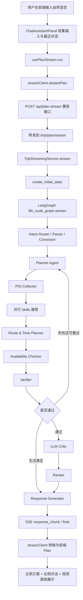
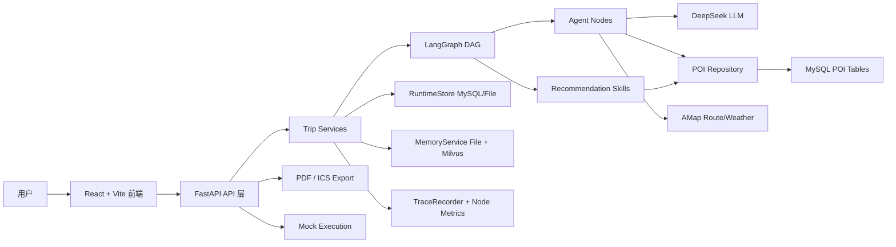
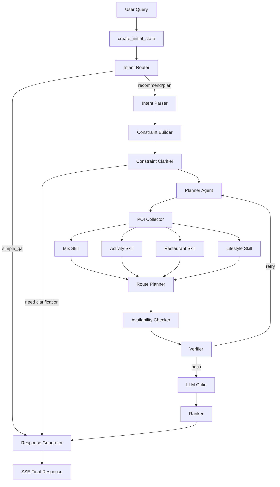
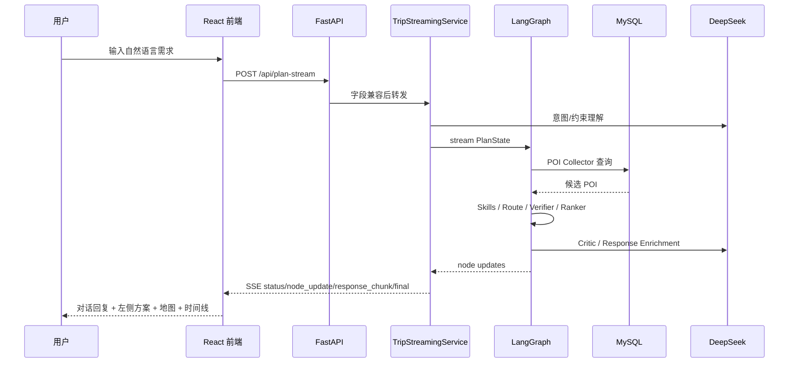

# LifeRouteAgent 项目详细介绍文档

> 本文基于 `C:\Users\dengp\project\LifeRouteAgent` 当前仓库代码整理，重点解释实际已实现的模块、调用链路、数据结构和工程边界。凡是代码中仍是 mock、预留接口或半成品的能力，本文会明确标注。

## 1. 项目整体介绍

### 项目名称

项目名称是 **LifeRouteAgent**，代码中的 API 标题为 `LifeRouteAgent API`，前端品牌文案当前意图是“生活路线 / 智能生活规划”。

### 要解决的问题

LifeRouteAgent 解决的是“本地生活周末/半日活动怎么安排”的问题。用户输入一句自然语言需求，例如：

```text
明天我要和对象去环球影城玩，然后去唱歌，两个人预算1000，帮我规划一下
```

系统尝试完成以下任务：

- 理解用户到底是简单问答、单类推荐，还是完整行程规划；
- 提取人数、预算、时间、偏好、指定地点、排除项等约束；
- 从本地 MySQL POI 数据库召回候选地点；
- 用不同 Skill 对餐厅、活动、娱乐、购物、景点等候选进行打分；
- 组合成 1-3 个可执行行程方案；
- 计算时间线、路线段、交通耗时和预算；
- 用 Verifier / Critic 检查方案风险；
- 生成用户可读回复；
- 提供 mock 执行、PDF 导出、ICS 日历导出、Trace 观测和 Memory 能力。

### 面向用户场景

当前项目面向的核心场景是：

- 家庭/亲子周末活动；
- 朋友聚会：吃饭、KTV、棋牌、桌游、电影；
- 情侣约会：景点、环球影城、展览、餐厅、唱歌；
- 单类推荐：餐厅、KTV、按摩、活动、商场；
- 简单问答：询问系统能力、模型身份、使用方式。

### 核心价值

普通搜索工具返回“地点列表”，普通聊天机器人容易只给“文字建议”。LifeRouteAgent 的目标是输出**可执行方案**：

- 有具体 POI；
- 有顺序；
- 有开始和结束时间；
- 有路线段；
- 有预算估算；
- 有可执行动作；
- 有失败降级和观测记录。

### 和普通搜索/推荐/聊天机器人的区别

| 类型 | 普通实现 | LifeRouteAgent 当前实现 |
| --- | --- | --- |
| 搜索 | 输入关键词，返回列表 | 先理解 intent，再选择 Collector + Skill |
| 推荐 | 只按评分/热度 | 综合场景、预算、时间、类别、距离和 Memory 加权 |
| 聊天 | 生成自然语言 | 简单问答走文本，规划任务走 LangGraph DAG |
| 路线 | 常常缺失 | 生成 route_segments，并可接高德路线；失败回退 Haversine |
| 执行 | 通常没有 | 预留并实现 mock 预约、票务、打车、日历导出 |
| 可观测 | 少量日志 | trace_id/run_id/session_id、tool trace、node metrics |
| 记忆 | 单轮上下文 | 文件 Memory + 可选 Milvus 向量记忆 |

### 当前代码实际实现程度

已实现：

- FastAPI 后端；
- React + Vite 前端；
- LangGraph DAG 编排；
- `PlanState` 全局状态；
- LLM 意图理解、Planner DAG、Revision、Memory Extractor、Critic、Response Enrichment 的调用入口；
- DeepSeek OpenAI-compatible HTTP 调用封装；
- Pydantic LLM 输出 schema 校验；
- MySQL POI 仓储；
- 七类 POI 表 SQL；
- Skill Registry；
- 四个推荐 Skill；
- Route Planner 组合搜索与路线段生成；
- Verifier / LLM Critic；
- SSE 流式规划；
- session 续跑、checkpoint、mock 执行；
- PDF / ICS 导出；
- AMap 路线、天气、前端地图接入入口；
- RuntimeStore：MySQL 主存储 + 文件 fallback；
- Memory：文件画像 + Milvus 可选增强；
- TraceRecorder、ToolHarness、ToolPolicy、PromptRegistry；
- 后端测试 100+ 条。

已预留 / mock / 未完全实现：

- 餐厅预约、购票、打车都是 mock，不调用真实平台 API；
- 支付/退款只做风险等级设计，不执行真实动作；
- PDF 是最小 PDF 生成，中文支持有限；
- Milvus 是可选增强，Python 3.13 下 `pymilvus` 依赖被条件跳过，可能不可用；
- 前端高德 JS 地图需要 `VITE_AMAP_JS_KEY`，但后端也有 `/trip/client-config`，当前前端代码仍主要读 Vite 环境变量；
- 部分 Python 和前端文件的中文注释/文案存在编码乱码，这是当前明显不足；
- `backend/app/models/db_models.py` 当前为空；
- API 层虽然已拆出 `TripPlanningService`、`TripStreamingService`、`TripRevisionService`，但 `trip.py` 仍保留大量辅助函数和兼容逻辑，仍偏厚。

## 2. 项目运行方式

### 后端启动

推荐在仓库根目录创建虚拟环境后安装依赖：

```powershell
cd C:\Users\dengp\project\LifeRouteAgent
python -m venv .venv
.\.venv\Scripts\pip.exe install -r backend\requirements.txt
```

启动后端：

```powershell
cd C:\Users\dengp\project\LifeRouteAgent\backend
..\.venv\Scripts\python.exe -m uvicorn app.api.main:app --host 127.0.0.1 --port 8000
```

健康检查：

```text
GET http://127.0.0.1:8000/health
```

### 前端启动

当前前端实际技术栈是 **React + TypeScript + Vite**，不是旧 README 中写的 Vue。

```powershell
cd C:\Users\dengp\project\LifeRouteAgent\frontend
npm install
npm run dev -- --host 127.0.0.1 --port 5173
```

前端默认访问：

```text
http://127.0.0.1:5173
```

Vite 代理配置在 `frontend/vite.config.ts`：

- `/api` -> `http://127.0.0.1:8000`
- `/trip` -> `http://127.0.0.1:8000`

### 配置文件与环境变量

后端配置统一从文件读取，入口是 `backend/app/config.py`。

读取优先级：

1. `backend/config.local.json`
2. `backend/config.example.json`

`config.local.json` 适合本地真实 key；`config.example.json` 是仓库示例配置。当前代码不再强依赖系统环境变量。

主要配置项：

```json
{
  "LLM_PROVIDER": "deepseek",
  "DEEPSEEK_API_KEY": "",
  "DEEPSEEK_BASE_URL": "https://api.deepseek.com",
  "DEEPSEEK_MODEL": "deepseek-v4-pro",
  "AMAP_API_KEY": "",
  "AMAP_ROUTE_ENABLED": false,
  "LIFEROUTE_USE_DATABASE": true,
  "DATABASE_HOST": "127.0.0.1",
  "DATABASE_PORT": 3306,
  "DATABASE_USER": "root",
  "DATABASE_PASSWORD": "",
  "DATABASE_NAME": "life_route_agent",
  "MILVUS_ENABLED": true,
  "RUNTIME_STORE": "mysql",
  "RUNTIME_MYSQL_ENABLED": true,
  "PROMPT_VERSION_ENFORCED": true
}
```

前端高德 JS 地图当前读取：

- `VITE_AMAP_JS_KEY`
- `VITE_AMAP_SECURITY_CODE`

相关代码在 `frontend/src/lib/amap.ts`。

### 后端依赖

`backend/requirements.txt` 当前包含：

- `fastapi`
- `uvicorn[standard]`
- `langgraph`
- `pydantic`
- `python-dotenv`
- `httpx`
- `pytest`
- `pymysql`
- `pymilvus; python_version < "3.13"`
- `sentence-transformers`
- `numpy`

注意：`pymilvus` 在 Python 3.13 下不会安装，因此 Milvus 相关能力会降级。

### 前端依赖

`frontend/package.json` 当前包含：

- `react`
- `react-dom`
- `lucide-react`
- `typescript`
- `vite`
- `@vitejs/plugin-react`

### Docker Compose

仓库有 `docker-compose.milvus.yml`，用于启动 Milvus Standalone：

```powershell
docker compose -f docker-compose.milvus.yml up -d
```

其中包含：

- etcd
- minio
- milvus

没有发现用于完整后端/前端/MySQL 一键启动的 docker-compose。

### 数据库依赖

真实 POI 召回依赖 MySQL。SQL 文件位于：

```text
database/sql/
```

七类表：

- `poi_attractions.sql`
- `poi_shoppings.sql`
- `poi_activities.sql`
- `poi_restaurant.sql`
- `poi_fitness.sql`
- `poi_entertainment.sql`
- `poi_beauty.sql`

Runtime 存储表由脚本创建：

```powershell
cd C:\Users\dengp\project\LifeRouteAgent\backend
..\.venv\Scripts\python.exe scripts\init_runtime_schema.py
```

会创建：

- `runtime_sessions`
- `runtime_tasks`
- `runtime_tool_cache`
- `runtime_trace_events`
- `runtime_node_metrics`

### Redis / 向量库

- Redis：当前代码未使用。
- Milvus：可选，用于向量记忆；不可用时回退文件记忆。

### Mock 数据在哪里

当前没有一个独立、完整的 `mock_data` 目录。mock/fallback 主要分布在代码中：

- 执行 mock：`backend/app/api/routes/trip.py` 中的 `/trip/execute/stream` 相关逻辑；
- 高德路线 fallback：`backend/app/services/amap_route_service.py`；
- 高德天气 fallback：`backend/app/services/amap_weather_service.py`；
- PDF 最小生成：`backend/app/api/routes/export.py`；
- 兼容城市列表：`backend/app/api/routes/compat.py`；
- 部分测试用例使用内联样本。

### 测试运行

后端：

```powershell
cd C:\Users\dengp\project\LifeRouteAgent\backend
..\.venv\Scripts\python.exe -m pytest tests -q
```

前端：

```powershell
cd C:\Users\dengp\project\LifeRouteAgent\frontend
npm run build
```

当前已验证后端测试通过：`109 passed, 1 warning`；前端 build 也通过。

### 当前运行方式缺失项

- 没有完整 Docker Compose 一键启动 MySQL + 后端 + 前端 + Milvus；
- 没有数据库迁移工具，POI 表 SQL 和 runtime 表脚本分离；
- 前端地图 key 和后端 `/trip/client-config` 尚未完全统一；
- README 之前与实际技术栈不一致，本次已重写。

## 3. 项目目录结构详解

当前根目录：

```text
LifeRouteAgent/
├── assets/
├── backend/
├── database/
├── docs/
├── frontend/
├── scripts/
├── docker-compose.milvus.yml
├── README.md
├── CHANGELOG.md
└── LICENSE
```

### backend

`backend` 是 Python 后端，按 API、Agent、DAG、Service、Tool、State、Model 分层。

```text
backend/
├── app/
│   ├── agents/
│   ├── api/
│   ├── dag/
│   ├── models/
│   ├── services/
│   ├── state/
│   ├── tools/
│   └── config.py
├── config/
├── scripts/
├── tests/
├── config.example.json
└── requirements.txt
```

为什么这样分层：

- `api` 只暴露 HTTP 接口；
- `dag` 定义 LangGraph 流程；
- `agents` 是 DAG 节点；
- `tools` 是推荐 Skill 和统一 POI schema；
- `services` 是 LLM、数据库、Memory、Trace、Runtime、导出等基础服务；
- `state` 定义跨节点传递的状态；
- `models` 定义 API schema；
- `tests` 覆盖节点、DAG、API、Memory、Runtime、评测。

### frontend

当前前端是 React：

```text
frontend/
├── src/
│   ├── api/
│   ├── components/
│   ├── hooks/
│   ├── lib/
│   ├── pages/
│   ├── styles/
│   ├── types/
│   ├── App.tsx
│   └── main.tsx
├── package.json
└── vite.config.ts
```

分层意图：

- `api/streamClient.ts` 封装后端请求和 SSE；
- `hooks/usePlanStream.ts` 管理规划流式状态；
- `components` 放通用 UI 组件；
- `pages` 放页面级视图；
- `types/agent.ts` 放前端数据类型；
- `styles/global.css` 统一商业化界面样式。

### docs

当前仓库原本没有 `docs` 目录；本次新增 `docs/PROJECT_INTRODUCTION.md`，用于答辩、代码讲解、简历项目介绍和维护交接。

### database

`database/sql` 存放 POI 表结构和导入 SQL。它是本地生活推荐的数据基础。

### 配置文件

- `backend/config.example.json`：后端示例配置；
- `backend/config/*.yaml`：业务策略配置，但实际采用 JSON-compatible YAML，即内容按 JSON 解析；
- `docker-compose.milvus.yml`：Milvus standalone；
- `frontend/vite.config.ts`：前端 dev server 和代理。

### 测试目录

`backend/tests` 包含：

- intent / constraint / planner / route / verifier / ranker 单测；
- API 测试；
- Memory 和向量测试；
- RuntimeStore / Prompt / Observability 测试；
- eval suite 测试。

`backend/tests/evals/local_life_benchmark.json` 是固定 benchmark 数据文件。

### mock 数据目录

当前没有独立 mock 数据目录。mock 行为主要在服务 fallback 或测试样例中。

## 4. 后端架构详解

### API 层

入口：`backend/app/api/main.py`

职责：

- 创建 FastAPI app；
- 配置 CORS；
- 注册路由：
  - `trip.router`
  - `export.router`
  - `compat.router`
- 提供 `/health`。

核心路由：`backend/app/api/routes/trip.py`

主要接口：

- `/trip/plan`
- `/trip/plan/stream`
- `/trip/plan/revise/stream`
- `/trip/execute/stream`
- `/trip/plan/adjust`
- `/trip/calendar/ics`
- `/trip/trace/{trace_id}`
- `/trip/task/{task_id}`
- `/trip/task/{task_id}/resume`
- `/trip/observability/node-metrics`
- `/trip/memory/*`
- `/trip/data-source`

当前状态：

- 已经拆出 `TripPlanningService`、`TripStreamingService`、`TripRevisionService`、`TripExecutionService`、`TaskRecoveryService`；
- 但 `trip.py` 仍保留执行 mock、局部调整、兼容转换等较多逻辑，API 层仍偏厚。

兼容 API：`backend/app/api/routes/compat.py`

- `/api/cities`
- `/api/user/profile`
- `/api/plan-stream`

用于兼容旧前端请求。

导出 API：`backend/app/api/routes/export.py`

- `/export/health`
- `/export/plan/pdf`

PDF 导出是最小 PDF 实现，中文以 unicode escape 方式保底，未完全产品级。

### Service 层

Service 层位于 `backend/app/services`。

代表文件：

- `trip_services.py`：规划、流式、修正、执行、恢复服务；
- `llm_service.py`：DeepSeek/MiMo OpenAI-compatible 调用；
- `prompt_registry.py`：prompt/schema 版本治理；
- `llm_output_schemas.py`：LLM 输出 Pydantic schema；
- `context_builder.py`：LLM 上下文快照构建；
- `poi_repository.py`：MySQL POI 仓储；
- `amap_route_service.py`：高德路线适配和 Haversine fallback；
- `amap_weather_service.py`：高德天气适配和 fallback；
- `memory_service.py`：混合记忆服务；
- `memory_store.py`：文件记忆、SessionMemory、ToolCache 接口；
- `vector_memory_store.py`：Milvus 向量记忆；
- `embedding_service.py`：本地 embedding；
- `checkpoint_store.py`：任务 checkpoint；
- `runtime_store.py`：MySQL/File runtime store；
- `trace_recorder.py`：Trace 和节点耗时；
- `tool_harness.py`：统一 timeout/retry/fallback/cache/trace；
- `tool_policy.py`：工具风险等级、参数校验、幂等；
- `policy_config.py`：读取规划/类别/风险配置；
- `eval_runner.py`：多层评测 runner。

### Agent 层

Agent 节点位于 `backend/app/agents`。

当前 Agent 不是独立进程，也不是每个节点都有一个独立 LLM；它们是 LangGraph 中的 Python 节点函数，部分节点调用 LLM。

主要节点：

- `intent_router.py`：判断 simple_qa/category/full_plan；
- `intent_parser.py`：提取结构化意图；
- `constraint_builder.py`：构建约束；
- `constraint_clarifier.py`：判断是否需要追问；
- `planner_agent.py`：选择模板、slots、Skill、Collector 类别；
- `poi_collector.py`：从仓储拉 POI；
- `route_planner.py`：生成时间线和路线；
- `availability_checker.py`：基础可用性检查；
- `verifier.py`：规则校验；
- `llm_critic.py`：软性合理性审查；
- `ranker.py`：方案排序；
- `response_generator.py`：回复与方案解释；
- `execution_agent.py`：DAG 内预留执行节点。

### Workflow / DAG 层

文件：`backend/app/dag/langgraph_dag_config.py`

职责：

- 创建 `StateGraph(PlanState)`；
- 添加节点；
- 配置条件边；
- 配置并行 Skill；
- 编译为 `life_route_graph`。

### Tool 层

文件：`backend/app/tools`

职责：

- 统一 POI schema；
- Skill Registry；
- 四个推荐 Skill：
  - `poi_mix_recommend.py`
  - `poi_activity_recommend.py`
  - `poi_restaurant_recommend.py`
  - `poi_lifestyle_recommend.py`

Tool 层输出 `RecommendedPoiRecord`，供 Route Planner 组合。

### Recommender 层

项目没有单独 `recommenders` 目录，推荐逻辑实际在 `backend/app/tools` 四个 Skill 中。

推荐逻辑主要基于：

- LLM 提取的结构化语义字段；
- 类别匹配；
- 场景适配；
- 预算适配；
- crowd risk；
- Memory 加权；
- 推荐分 `score`。

### Schema / Model 层

文件：`backend/app/models/schemas.py`

主要 API 模型：

- `TripPlanRequest`
- `TripPlanResponse`
- `ExecutePlanRequest`
- `ExportPlanRequest`
- `AdjustPlanRequest`
- `RevisePlanRequest`
- `DataSourceStatusResponse`

`backend/app/models/db_models.py` 当前为空，未实现 ORM 模型。

### Memory 层

核心文件：

- `memory_service.py`
- `memory_store.py`
- `vector_memory_store.py`
- `embedding_service.py`
- `memory_scoring.py`

当前是混合设计：

- 文件层：可读、可审计、fallback；
- Milvus：可选语义检索、相似画像；
- Memory 是软约束，不覆盖本轮明确需求。

### Prompt 层

没有独立 `prompts/` 目录。Prompt 目前主要写在 Agent/Service 的 Python 文件中：

- `llm_understanding.py`
- `llm_semantic_extractor.py`
- `llm_critic.py`
- `response_generator.py`

版本元数据在：

- `prompt_registry.py`

输出约束在：

- `llm_output_schemas.py`

### Utils 层

项目没有单独 `utils` 目录，工具型能力散落在：

- `trace_recorder.py`
- `runtime_paths.py`
- `policy_config.py`
- 各 Agent 内部 helper 函数。

## 5. 前端架构详解

### 技术栈

当前代码实际使用：

- React
- TypeScript
- Vite
- lucide-react
- 原生 CSS
- fetch + ReadableStream 解析 SSE

### 页面整体布局

入口：`frontend/src/App.tsx`

`App` 维护：

- 当前视图 `activeView`
- 最新方案 `latestPlan`
- 最新 trace events
- 当前城市 `city`

布局壳：`frontend/src/components/AppShell.tsx`

包括：

- 左侧导航；
- 快捷入口；
- 顶部城市选择；
- 主内容区。

当前导航包括：

- 首页
- 我的规划
- 收藏夹
- 历史记录
- 日历
- 个人中心
- 观测面板

注意：当前文件中文文案存在编码乱码，但结构是上述含义。

### 核心组件

- `PlannerWorkspace.tsx`：规划主工作台；
- `ChatAssistantPanel.tsx`：右侧对话区；
- `AmapRouteCard.tsx`：高德地图/路线卡片；
- `MapModal.tsx`：地图弹窗；
- `PlanDetailModal.tsx`：方案/备选详情弹窗；
- `PlanTimeline.tsx`：时间线组件；
- `InsightPanel.tsx`：洞察/天气等辅助信息；
- `StreamTrace.tsx`：流式过程展示；
- `ObservabilityPage.tsx`：观测面板；
- `OperationsConsole.tsx`：规划后的操作页；
- `UserSectionPage.tsx`：个人中心等占位页面。

### 对话区如何实现

`ChatAssistantPanel.tsx` 本地维护消息数组：

- welcome 消息；
- 用户消息；
- assistant 回复；
- 规划过程折叠面板。

发送消息时调用 `onSend(goal, history)`，history 取最近 8 条 user/assistant 对话。

### 规划卡片如何展示

`PlannerWorkspace.tsx` 从 `usePlanStream()` 获取 `plan`，然后渲染：

- 主推荐卡；
- 标签；
- 评分；
- 总时长；
- 距离；
- 人均费用；
- 路线卡；
- 时间线；
- 更多备选；
- 底部操作按钮。

### 时间轴如何展示

主要在 `PlannerWorkspace.tsx` 内部渲染行程列表；`PlanTimeline.tsx` 也提供一个独立时间线组件。

前端从后端 `ranked_plans[].timeline` 和 `items` 合并出 `PlanStep`。

### POI / 餐厅 / 活动卡片如何展示

`streamClient.ts` 中 `buildStep()` 把后端 item 转为前端 `PlanStep`，包括：

- title
- start_time
- end_time
- location
- reason
- cost
- booking_required
- detail：图片、标签、描述、交通、费用、地址。

实际卡片展示在 `PlannerWorkspace.tsx` 和 `PlanDetailModal.tsx`。

### 状态管理

没有 Redux/Zustand。状态主要在：

- `App.tsx`
- `PlannerWorkspace.tsx`
- `usePlanStream.ts`
- 各组件局部 `useState`

### API 请求封装

文件：`frontend/src/api/streamClient.ts`

职责：

- `streamPlan()` 发送 SSE；
- 解析 SSE frame；
- 把后端 `TripPlanResponse` 转为前端 `Plan`；
- 封装兼容 API：
  - `/api/plan-stream`
  - `/api/cities`
  - `/api/user/profile`
  - 以及若干 `/api/plans/{planId}/{action}` 风格接口。

注意：后端当前未完整实现所有 `/api/plans/{planId}/{action}`，这部分存在前后端接口不完全一致的风险，需要进一步确认和补齐。

### 类型定义

文件：`frontend/src/types/agent.ts`

定义：

- `Scenario`
- `StepType`
- `BookingStatus`
- `Location`
- `Person`
- `UserIntent`
- `PlanStep`
- `BookingAction`
- `RouteSegment`
- `PlanAlternative`
- `WeatherInfo`
- `Plan`
- `StreamEvent`
- `StreamRequest`

### 样式组织

样式集中在 `frontend/src/styles/global.css`。整体是商业化卡片式 UI：

- sidebar；
- topbar；
- planner workspace；
- recommendation card；
- route card；
- chat panel；
- observability page。

当前不足：文案乱码严重影响 UI 展示，需要优先修复编码。

## 6. 核心业务流程

### 端到端流程



### 后端请求如何被解析

`/trip/plan/stream` 接收 `TripPlanRequest`：

```python
user_query: str
user_profile: dict
max_replanning_count: int
session_id: str | None
trace_id: str | None
run_id: str | None
```

`TripStreamingService.stream()` 做：

1. 获取或创建 `session_id`；
2. 创建 `trace_id/run_id/task_id`；
3. 读取上一轮 session；
4. 如果上一轮是追问，调用 `effective_query_for_request()` 合并；
5. `MemoryService.observe_user_query()` 写入用户输入；
6. `MemoryService.enrich_user_profile()` 注入画像和相关记忆；
7. `create_initial_state()` 生成 `PlanState`；
8. `CheckpointStore.save_from_plan_state()` 保存 CREATED；
9. `life_route_graph.stream()` 执行 DAG；
10. 每个节点输出 SSE；
11. 最终调用 `build_trip_response()`；
12. 保存 session turn；
13. 输出 `final` 和 `done`。

### 如何召回活动或餐厅

`planner_agent_node()` 决定 `collector_categories`，例如：

- `poi_restaurant`
- `poi_activity`
- `poi_entertainment`

`poi_collector_node()` 调用 `PoiRepository.fetch_by_categories()`。

`PoiRepository` 用固定 SQL 从 MySQL 查询，避免表名由用户输入拼接。

### 如何生成候选方案

各 Skill 写入 `recommended_pois`。`route_time_planner_node()` 从 `recommended_pois` 读取候选，按 `dag_plan.slot_sequence` 枚举组合：

- slot-based；
- compact；
- score-based；
- offset score-based；
- must_items 强制保留。

最终保留 3 个左右方案。

### 如何排序

`ranker_node()` 对 `verified_plans` 或 `candidate_plans` 进行排序，结合：

- route minutes；
- total duration；
- estimated budget；
- fit summary；
- issue penalty；
- memory fit 等。

具体排序规则需要进一步看 `backend/app/agents/ranker.py` 细节；当前文档只确认其存在且参与 DAG。

### 如何验证

`availability_checker_node()` 做基础可用性检查。

`verifier_node()` 做确定性校验，并通过 `verifier_route()` 决定：

- 进入 Ranker；
- 回退 Planner；
- 直接生成 Response。

`llm_critic_node()` 位于 Verifier 和 Ranker 之间，用 LLM 做软性合理性审查。

## 7. Agent 工作流详解

### 当前有哪些 Agent

| Agent / Node | 文件 | 是否调用 LLM | 职责 |
| --- | --- | --- | --- |
| Intent Router | `agents/intent_router.py` | 是，失败规则兜底 | 判断任务类型 |
| Intent Parser | `agents/intent_parser.py` | 间接消费 LLM understanding | 写入结构化 intent |
| Constraint Builder | `agents/constraint_builder.py` | 主要规则/消费 LLM 结果 | 归一化约束 |
| Constraint Clarifier | `agents/constraint_clarifier.py` | 消费 LLM 结果 + 规则 | 判断是否追问 |
| Planner Agent | `agents/planner_agent.py` | 消费 LLM dag_plan，fallback 规则 | 选择模板、slots、skills |
| POI Collector | `agents/poi_collector.py` | 否 | 数据库召回 |
| Skill Nodes | `tools/*.py` | 否，使用结构化语义字段 | 推荐打分 |
| Route Planner | `agents/route_planner.py` | 否 | 组合方案、路线、时间线 |
| Availability Checker | `agents/availability_checker.py` | 否 | 可用性检查 |
| Verifier | `agents/verifier.py` | 否 | 确定性校验 |
| LLM Critic | `agents/llm_critic.py` | 是 | 软性合理性审查 |
| Ranker | `agents/ranker.py` | 否 | 排序 |
| Response Generator | `agents/response_generator.py` | 是，失败模板兜底 | 用户回复和方案解释 |
| Execution Agent | `agents/execution_agent.py` | 否 | DAG 内预留执行 |

### 状态如何传递

所有节点接收 `PlanState`，返回 `PlanStatePatch`。LangGraph 将 patch 合并进全局 state。

核心 state 在 `backend/app/state/plan_state.py`。

### Workflow State 结构

核心字段：

```python
PlanState = {
  "user_query": str,
  "user_profile": dict,
  "constraints": dict,
  "candidate_pois": dict,
  "recommended_pois": dict,
  "routes": list,
  "candidate_plans": list,
  "verified_plans": list,
  "ranked_plans": list,
  "selected_plan": dict,
  "execution_status": str,
  "logs": list,
  "errors": list,
  "response_text": str,
  "dag_plan": dict,
  "intent_type": str,
  "target_categories": list,
  "answer_mode": str,
  "need_clarification": bool,
  "missing_constraints": list,
  "clarify_question": str,
  "session_id": str,
  "trace_id": str,
  "run_id": str,
  "task_id": str,
  "tool_evidence": list,
  "booking_actions": list
}
```

### 哪些步骤是 LLM 推理

实际调用入口是 `backend/app/services/llm_service.py`：

- Intent Understanding；
- Revision Parser；
- Memory Extractor；
- LLM Critic；
- Response Enrichment；
- Response Generator。

所有 LLM 调用：

- 走 DeepSeek/OpenAI-compatible HTTP；
- 通过 `ToolHarness.run_request()`；
- 写 trace；
- 带 prompt/schema version；
- 输出经 Pydantic schema 校验；
- 失败返回 None，由上层 fallback。

### 哪些步骤是工具调用

外部/慢 I/O：

- MySQL POI 查询；
- 高德路线；
- 高德天气；
- LLM HTTP；
- PDF；
- ICS；
- 执行 mock；
- Milvus；
- embedding。

大部分已接入 `ToolHarness`，但不是所有历史 helper 都完全收口，仍有治理覆盖边界。

### 哪些步骤是规则逻辑

- 预算数值归一；
- 默认时间和时长；
- slot 到类别映射；
- route Haversine fallback；
- Verifier 确定性校验；
- ToolPolicy 参数校验；
- LLM 失败 fallback；
- 部分 Skill 打分。

### 失败时如何降级

- LLM 失败：规则/模板兜底；
- MySQL 失败：返回空候选；
- AMap 失败：Haversine fallback；
- Milvus 失败：文件 Memory fallback；
- PDF harness 失败：重新最小生成；
- 执行 mock 失败：fallback 步骤；
- Verifier 不通过：回退 Planner 或生成无法满足说明。

### 当前实现和理想设计差距

- 部分中文文案/注释乱码；
- API 层仍偏厚；
- Prompt 仍散落在代码里，没有独立 prompt 文件；
- Skill 仍主要规则排序，不是真正 LLM Tool Agent；
- 真实交易 API 未接；
- Runtime Store 有 MySQL，但还不是完整平台级 Observability；
- 前后端部分兼容接口不完全一致；
- 部分配置 YAML 实际按 JSON 解析，容易误导。

## 8. Tool / Recommender 设计

### 当前有哪些工具

| 工具/服务 | 文件 | 输入 | 输出 | 状态 |
| --- | --- | --- | --- | --- |
| POI DB 查询 | `poi_repository.py` | categories / keywords | `dict[category, PoiRecord[]]` | 已实现 |
| 高德路线 | `amap_route_service.py` | 两个 POI 坐标 | `AmapRouteEstimate` | 已实现，需 key，失败 fallback |
| 高德天气 | `amap_weather_service.py` | city | weather dict | 已实现，需 key，失败 fallback |
| LLM | `llm_service.py` | messages | text/JSON | 已实现，失败 fallback |
| PDF | `export.py` | plan | PDF bytes | mock/轻量实现 |
| ICS 日历 | `calendar_service.py` | plan | text/calendar | 已实现 |
| 执行 mock | `trip.py` | plan | SSE steps | mock |
| Milvus Memory | `vector_memory_store.py` | memory/profile text | search/upsert | 可选增强 |

### 推荐 Skill

四个 Skill：

- `poi_mix_recommend.py`：景点、商场、轻活动；
- `poi_activity_recommend.py`：活动、票券、体验；
- `poi_restaurant_recommend.py`：餐厅；
- `poi_lifestyle_recommend.py`：健身、娱乐、美容养生。

输入：

- `PlanState.candidate_pois`
- `PlanState.constraints`
- `PlanState.dag_plan`
- `user_profile.memory_*`

输出：

- `PlanState.recommended_pois`

每个推荐结果统一为：

- id/name/category/subcategory/lat/lon/address/rating；
- price_level/open_status/tags；
- score/reason/risk_flags；
- estimated_duration_minutes；
- reservation_required；
- crowd_risk；
- budget_fit；
- scene_fit；
- distance_sensitive。

### 是否使用 mock 数据

POI 推荐默认使用 MySQL。如果数据库不可用，仓储 fallback 返回空列表，不会自动生成大量假 POI。

执行、PDF、天气/路线 fallback 是 mock/降级能力。

### route / availability / weather / reservation 实现状态

- route：已实现组合与高德/回退；
- availability：有基础 checker 和 verifier，不是真实库存/排队；
- weather：高德实时天气接入 + fallback；
- reservation：mock 执行，不是真实 API；
- ticket：mock 执行，不是真实购票；
- taxi：mock 执行，不是真实叫车。

## 9. 数据模型与类型设计

### 用户请求结构

后端 `TripPlanRequest`：

```json
{
  "user_query": "周末和朋友出去玩4小时，想打麻将然后唱歌，预算200",
  "user_profile": {},
  "max_replanning_count": 2,
  "session_id": "optional",
  "trace_id": "optional",
  "run_id": "optional"
}
```

前端 `StreamRequest`：

```ts
{
  goal: string;
  city: string;
  execute: boolean;
  fail_next_restaurant_booking: boolean;
  history?: ChatHistoryItem[];
  session_id?: string;
}
```

前端通过 `streamClient.ts` 转成后端请求。

### 用户画像结构

后端 `MemoryService.enrich_user_profile()` 注入：

```json
{
  "session_id": "...",
  "user_id": "...",
  "memory_profile": {},
  "memory_context": {
    "profile_summary": "...",
    "snippets": [],
    "memory_fit_tags": [],
    "source": "file|milvus+file"
  },
  "similar_user_preferences": [],
  "profile_cluster": {},
  "preferred_city": "...",
  "preferred_areas": [],
  "indoor_preference": false,
  "disliked_keywords": [],
  "favorite_categories": {}
}
```

### 约束结构

约束存在 `PlanState.constraints`，常见字段：

- `llm_understanding`
- `scenario`
- `people_count`
- `preferences`
- `activity_intents`
- `preference_keywords`
- `excluded_keywords`
- `must_pois`
- `start_time`
- `duration_hours`
- `budget`
- `max_route_minutes`
- `indoor_preferred`
- `avoid_tags`

### POI 结构

`PoiRecord`：

```json
{
  "id": "xxx",
  "name": "某KTV",
  "category": "poi_entertainment",
  "subcategory": "KTV",
  "lat": 39.9,
  "lon": 116.4,
  "address": "北京市...",
  "rating": 4.7,
  "price_level": "medium",
  "open_status": "unknown",
  "tags": ["KTV", "娱乐"]
}
```

### Activity / Restaurant 结构

代码没有单独 Activity/Restaurant 类型类，统一映射为 `PoiRecord` 和 `RecommendedPoiRecord`。

差异通过：

- `category`
- `subcategory`
- `tags`
- `avg_price`
- `reservation_required`
- `estimated_duration_minutes`

表示。

### ItineraryItem / ItineraryPlan

后端没有独立 Pydantic 模型，方案是 dict：

```json
{
  "plan_id": "plan_route_1",
  "title": "朋友娱乐聚会方案",
  "items": [],
  "timeline": [],
  "route_segments": [],
  "estimated_budget": 500,
  "total_duration_minutes": 240,
  "route_minutes": 35,
  "fit_summary": {}
}
```

前端转成 `Plan`：

```ts
interface Plan {
  id?: string;
  trace_id?: string;
  run_id?: string;
  session_id?: string;
  scenario: Scenario;
  start_time: string;
  end_time: string;
  total_duration_min: number;
  total_cost: number;
  steps: PlanStep[];
  actions: BookingAction[];
  route?: {...};
  alternatives?: PlanAlternative[];
  weather?: WeatherInfo;
}
```

### API Response

`TripPlanResponse`：

```json
{
  "response_text": "...",
  "execution_status": "completed",
  "intent_type": "full_trip_plan",
  "answer_mode": "plan",
  "need_clarification": false,
  "missing_constraints": [],
  "clarify_question": "",
  "selected_plan": {},
  "ranked_plans": [],
  "errors": [],
  "logs": [],
  "session_id": "...",
  "trace_id": "...",
  "run_id": "...",
  "revision_id": "",
  "is_revision": false,
  "task_id": "..."
}
```

## 10. Memory 设计

### 是否实现长期 Memory

是，当前实现了文件长期记忆和可选向量记忆。

核心文件：

- `memory_service.py`
- `memory_store.py`
- `vector_memory_store.py`
- `embedding_service.py`
- `runtime_paths.py`

### 是否有用户画像

有。`MemoryService.read_profile()` 读取用户画像，按 `user_id` 分文件。

画像字段包括：

- preferred_city
- preferred_areas
- indoor_preference
- disliked_keywords
- favorite_categories
- last_selected_plan_summary

### 是否有会话记忆

有。`FileMemoryStore.append_session_event()` 维护：

- rejected_plans；
- selected_plan_id；
- recent_revisions；
- conversation_summary；
- events。

### 是否有向量检索

有可选 Milvus：

- `VectorMemoryStore.upsert_memory()`
- `VectorMemoryStore.search_memory()`
- `VectorMemoryStore.upsert_user_profile()`
- `VectorMemoryStore.search_similar_profiles()`
- `VectorMemoryStore.profile_clusters()`

但 Milvus 不可用时全部回退文件检索。

### 是否有偏好提取

有。`MemoryService.observe_user_query()` 调用：

- `extract_memory_updates()`，位于 `llm_semantic_extractor.py`

LLM 不可用时走规则 fallback。

### 当前 Memory 存在哪里

运行时目录由 `runtime_paths.py` 定义，主要在：

```text
backend/data/runtime/memory/
backend/data/runtime/memory/users/
backend/data/runtime/sessions/
```

Runtime tool cache 可进入 MySQL `runtime_tool_cache`，也可文件 fallback。

### 规划时是否读取 Memory

是。`TripPlanningService` / `TripStreamingService` 调用：

```python
MemoryService().enrich_user_profile(...)
```

然后 `ContextBuilder` 将压缩后的 memory_context 注入 LLM 上下文。

Skill 排序中也会使用 Memory 加权。

### 规划后是否写入 Memory

是：

- 用户输入：`observe_user_query()`
- 用户采纳/执行方案：`observe_selected_plan()`
- 需求修正：`observe_revision()`
- 拒绝方案：`observe_rejected_plan()`

### 优点

- 文件层可读；
- Milvus 可选，不阻塞主流程；
- Memory 是软约束；
- 支持相似画像和 profile cluster 的基础能力；
- 支持会话内“上次差不多但别去某地”这一类扩展。

### 不足

- 多用户隔离已有目录结构，但仍需要更完整的 user_id 体系；
- Memory 更新的长期/临时边界依赖 LLM + fallback，仍需评测校准；
- Milvus schema 是运行时自动创建，生产环境应迁移到显式 migration；
- Python 3.13 下向量库依赖可能不可用；
- 部分 Memory 文件和注释存在乱码。

## 11. Prompt 设计

### Prompt 文件

当前没有独立 prompt 文件。Prompt 内联在：

- `backend/app/agents/llm_understanding.py`
- `backend/app/services/llm_semantic_extractor.py`
- `backend/app/agents/llm_critic.py`
- `backend/app/agents/response_generator.py`

### Prompt Registry

`backend/app/services/prompt_registry.py` 定义：

- prompt_name；
- prompt_version；
- schema_name；
- schema_version。

当前 prompt 版本如：

- `intent_understanding` -> `2026-05-31.1`
- `revision_parser` -> `2026-05-31.1`
- `memory_extractor` -> `2026-05-31.1`
- `planner_dag` -> `2026-05-31.1`
- `llm_critic` -> `2026-05-31.1`
- `response_generator` -> `2026-05-31.1`

### Prompt 输入上下文

LLM 理论上应通过 `ContextBuilder.build_for()` 获取：

- current_intent；
- user_constraints；
- planning_state；
- tool_evidence；
- conversation_summary；
- prompt_meta。

当前代码已经有该结构，但是否所有 LLM 调用完全强制通过 ContextBuilder，需要继续审计。

### 输出格式

LLM 输出经 `llm_output_schemas.py` 校验。

主要 schema：

- `IntentUnderstandingOutput`
- `RevisionConstraintOutput`
- `MemoryExtractionOutput`
- `DagPlanOutput`
- `CriticOutput`
- `ResponseEnrichmentOutput`
- `ResponsePlansEnrichmentOutput`

### 工程化稳定性

优点：

- 有 schema；
- 有 prompt version；
- 有 trace；
- LLM 失败 fallback；
- 不允许 LLM 直接写入未校验结构。

不足：

- Prompt 与代码耦合，未外置；
- Prompt 文案存在乱码；
- Prompt diff、灰度和 A/B 框架还没有；
- `PROMPT_VERSION_ENFORCED` 配置存在，但强制治理深度需要进一步确认。

## 12. API 接口文档

### 健康检查

```http
GET /health
```

响应：

```json
{"status": "ok"}
```

前端未直接依赖。

### 规划接口

```http
POST /trip/plan
```

请求：

```json
{
  "user_query": "周末和朋友出去玩4小时，想唱歌，预算300",
  "user_profile": {},
  "max_replanning_count": 2,
  "session_id": null,
  "trace_id": null,
  "run_id": null
}
```

响应：`TripPlanResponse`。

前端主流程不使用该接口，主要用于测试/非流式调用。

### 流式规划接口

```http
POST /trip/plan/stream
```

返回 `text/event-stream`。

事件包括：

- `status`
- `agent_thinking`
- `node_update`
- `response_chunk`
- `metadata`
- `final`
- `done`
- `error`

前端实际通过兼容接口 `/api/plan-stream` 调用。

### 兼容流式规划接口

```http
POST /api/plan-stream
```

位置：`backend/app/api/routes/compat.py`

作用：兼容旧前端字段名，把 `query/input/message/userMessage/text/prompt` 转为 `user_query`，再转发到 `/trip/plan/stream`。

前端调用位置：`frontend/src/api/streamClient.ts`。

### 多轮修改接口

```http
POST /trip/plan/revise/stream
```

请求模型：`RevisePlanRequest`

字段：

- `session_id`
- `user_query`
- `selected_plan_id`

作用：基于上一轮 session state 修正方案，而不是从空状态重跑。

当前前端主输入仍通过 `/api/plan-stream` 发送，多轮追问通过 `effective_query_for_request()` 合并；显式 revise 接口需要前端进一步接入。

### 局部调整接口

```http
POST /trip/plan/adjust
```

请求模型：`AdjustPlanRequest`

用途：替换某个 POI，重新计算局部结果。当前为第一版 slot-aware/替换能力，具体效果依赖已有候选和数据库。

### 执行接口

```http
POST /trip/execute/stream
```

说明：mock 执行，不调用真实预约/购票/打车 API。

事件：

- `execution_start`
- `execution_step`
- `calendar_ready`
- `execution_done`

### 日历接口

```http
POST /trip/calendar/ics
```

输出 `text/calendar` 文件流。

### PDF 导出

```http
POST /export/plan/pdf
```

输出 `application/pdf`。

当前是最小 PDF，不是完整中文排版。

### 用户画像接口

```http
GET /api/user/profile?user_id=default
GET /trip/memory/profile?user_id=default
GET /trip/memory/search?q=...&limit=5&user_id=default
DELETE /trip/memory?user_id=default
```

### Trace / Observability

```http
GET /trip/trace/{trace_id}
GET /trip/observability/node-metrics?trace_id=...
GET /trip/observability/runtime-health
GET /trip/evals/runtime-summary
```

### 数据源状态

```http
GET /trip/data-source
```

返回当前数据库配置、可用性和表统计。

## 13. 前后端交互

### 前端调用后端的位置

主要文件：

- `frontend/src/api/streamClient.ts`

核心调用：

- `fetch("/api/plan-stream", ...)`
- `fetch("/api/cities")`
- `fetch("/api/user/profile")`
- 部分 `/api/plans/{planId}/{action}` 操作接口。

### 请求体如何构造

`usePlanStream.run()` 接收：

```ts
{
  goal,
  city,
  execute,
  fail_next_restaurant_booking,
  history,
  session_id
}
```

`streamClient.streamPlan()` 转成后端兼容 payload。

### 返回数据如何渲染

`streamClient.ts` 解析 SSE，并将后端 `ranked_plans` 转成前端 `Plan`：

- `items + timeline` -> `steps`
- `route_segments` -> `route.segments`
- `response_text` -> `share_message`
- `ranked_plans[1..]` -> `alternatives`
- `weather` -> `WeatherInfo`

### loading / error

`usePlanStream.ts`：

- `isRunning` 控制加载；
- `events` 展示过程；
- `assistantText` 展示流式回复；
- `error` 事件追加到进度流。

### 类型是否一致

存在不完全一致：

- 后端返回 `ranked_plans`，前端转成 `Plan`；
- 后端 SSE 事件包括 `agent_thinking/node_update/metadata/final`，前端 `StreamEvent` 类型没有完整覆盖这些事件；
- 前端仍有 `/api/plans/{planId}/{action}` 风格调用，后端当前未完整提供所有对应接口；
- 中文字段展示文案存在乱码。

## 14. Mock 数据与真实 API 扩展

### 当前 mock/fallback

- 执行：mock；
- 订座：mock；
- 购票：mock；
- 打车：mock；
- PDF：轻量生成；
- 天气：高德失败 fallback；
- 路线：高德失败 Haversine fallback；
- 城市列表：兼容接口硬编码 demo 城市。

### 接入真实服务需要替换哪些模块

真实 POI/美团：

- 替换或扩展 `PoiRepository`；
- 增加具体平台 adapter；
- 保持输出 `PoiRecord`。

真实排队/库存：

- 增加 `availability` tool；
- 接入 `ToolHarness.run_request()`；
- 写入 `ToolCache`，短 TTL。

真实订座：

- 新增 `ReservationService`；
- RiskLevel = 3；
- 需要 `confirmed_source`、idempotency_key、verified target。

真实购票：

- 新增 `TicketService`；
- 需要库存查询先行；
- 支付场景 Level 4 停止自动执行。

真实地图：

- 后端继续扩展 `AmapRouteService`；
- 前端继续使用 `AmapRouteCard`。

当前架构方便替换的点：

- Collector 与 Skill 分离；
- POI schema 统一；
- ToolHarness 统一外部 I/O；
- Route Planner 消费统一 route segment；
- 前端通过统一 Plan 类型展示。

## 15. 错误处理与降级策略

### 用户输入不完整

Intent/Clarifier 会设置：

- `need_clarification`
- `missing_constraints`
- `clarify_question`

前端右侧对话展示回复；左侧可以不显示方案。

### 没有推荐结果

`route_time_planner_node()` 会写入 `candidate_empty` issue。Verifier 可能回退 Planner 或最终生成无法满足说明。

### LLM 输出异常

`llm_service.py` 返回 None；`llm_output_schemas.py` 记录 `schema_validation_failed`；Agent 使用规则 fallback。

### 工具调用失败

`ToolHarness` 统一处理：

- timeout；
- retry；
- fallback；
- trace；
- tool cache。

`ToolPolicy.classify_error()` 归类：

- timeout
- rate_limited
- slot_unavailable
- not_found
- payment_required
- permission_denied
- partial_success
- unknown

### 前端请求失败

`usePlanStream.ts` catch fetch/stream error，追加网络错误事件，并设置 `isRunning=false`。

### 日志与异常处理

有：

- TraceRecorder；
- runtime_trace_events；
- runtime_node_metrics；
- ToolHarness call_log；
- checkpoint_saved trace；
- 前端 ObservabilityPage。

没有：

- 平台级 OpenTelemetry；
- Prometheus/Grafana；
- 统一 FastAPI exception handler；
- 全链路日志采样策略。

## 16. 项目亮点

### 产品亮点

不是只返回 POI 列表，而是输出“时间线 + 路线 + 操作”的可执行方案。对应代码：

- `route_planner.py`
- `response_generator.py`
- `PlannerWorkspace.tsx`
- `AmapRouteCard.tsx`

### Agent 架构亮点

使用 LangGraph 把理解、召回、推荐、路线、校验、排序、回复串成 DAG，并支持失败回退。对应代码：

- `dag/langgraph_dag_config.py`

### 工程架构亮点

引入 RuntimeStore、Checkpoint、ToolHarness、ToolPolicy，而不是简单 demo 函数调用。对应代码：

- `runtime_store.py`
- `checkpoint_store.py`
- `tool_harness.py`
- `tool_policy.py`

### LLM 工程化亮点

LLM 输出有 PromptRegistry 和 Pydantic schema 校验，失败不污染 state。对应代码：

- `prompt_registry.py`
- `llm_output_schemas.py`
- `llm_service.py`

### Memory 亮点

文件记忆 + Milvus 可选增强，支持用户画像、语义检索、相似画像。对应代码：

- `memory_service.py`
- `memory_store.py`
- `vector_memory_store.py`

### 可扩展性亮点

Collector 和 Skill 分离，七类 POI 可以独立扩展。对应代码：

- `poi_repository.py`
- `poi_schema.py`
- `skill_registry.py`

### 前端交互亮点

右侧对话 + 左侧方案 + 地图 + 观测面板。对应代码：

- `PlannerWorkspace.tsx`
- `ChatAssistantPanel.tsx`
- `ObservabilityPage.tsx`

## 17. 当前不足

1. 部分中文乱码严重，影响答辩展示和可维护性。
2. API 层仍偏厚，`trip.py` 仍有大量 helper 和 mock 执行逻辑。
3. 前端部分接口和后端不完全一致。
4. Prompt 内联在代码中，不利于版本对比和灰度。
5. Skill 仍是规则推荐，不是真正独立 LLM Agent。
6. 真实预订/购票/打车未接入。
7. PDF 中文排版未产品化。
8. Milvus 是可选且依赖环境，Python 3.13 可能不可用。
9. MySQL runtime 已有，但还不是完整生产级迁移体系。
10. 没有完整 docker-compose 一键启动。
11. `db_models.py` 为空，没有 ORM 或领域模型。
12. 前端状态管理是局部 state，复杂交互增长后会难维护。
13. Observability 是本地 trace，不是平台级。
14. 测试不少，但端到端浏览器测试和真实 API mock server 仍不足。

## 18. 后续优化路线

### 第一阶段：短期可补齐

目标：保证展示稳定。

建议修改：

- 修复乱码：
  - `frontend/src/**/*.tsx`
  - `backend/app/services/*.py`
  - `backend/app/agents/*.py`
  - `backend/app/tools/*.py`
- 前后端接口对齐：
  - `frontend/src/api/streamClient.ts`
  - `backend/app/api/routes/compat.py`
  - `backend/app/api/routes/trip.py`
- 地图 key 统一：
  - `frontend/src/lib/amap.ts`
  - `/trip/client-config`
- README 和配置文档保持同步。

### 第二阶段：Hackathon 展示增强

目标：展示“像产品”。

建议修改：

- 加真实运行样例和截图；
- 观测面板增加 node metrics 图表；
- 方案详情弹窗展示 pros/cons、route_segments、Verifier issues；
- `execute/stream` 展示餐厅预约、票务、打车、日历导出逐步完成；
- `eval_runner.py` 增加命令行报告。

### 第三阶段：企业级 / 生产级增强

目标：接近真实业务系统。

建议修改：

- Prompt 外置：
  - 新增 `backend/app/prompts/*.md`
  - PromptRegistry 读取文件 hash；
- RuntimeStore 迁移：
  - 引入 Alembic 或专门 migration；
  - ToolCache 可迁 Redis；
- Observability：
  - OpenTelemetry；
  - Prometheus metrics；
  - Grafana dashboard；
- Tool 平台化：
  - 高风险工具审批；
  - 幂等表；
  - 交易补偿；
- 真实 API：
  - 地图公交路线；
  - 餐厅可订状态；
  - 票务库存；
  - 打车深链；
- 评测平台：
  - 固定 benchmark；
  - 对照实验；
  - 运行工件聚合。

## 19. 答辩讲解稿

大家好，我介绍一下我们的项目 LifeRouteAgent。

这个项目解决的是本地生活规划问题。比如用户周末想和朋友出去玩，普通搜索只能返回一堆餐厅、KTV、商场；普通聊天机器人可能只会给文字建议。但真实用户需要的是一个可执行方案：先去哪、几点到、路上多久、预算多少、有没有替代方案、能不能预约，甚至后续能不能导出日历或分享。

所以我们做了一个本地生活规划 Agent。用户只需要输入一句自然语言，比如“周末和朋友出去玩 4 个小时，想打麻将然后唱歌，预算 200”，系统会先判断这是简单问答、单类推荐还是完整规划。如果是完整规划，就进入 LangGraph 工作流。

后端采用 FastAPI + LangGraph。核心状态是 PlanState，里面保存用户输入、用户画像、约束、候选 POI、推荐 POI、路线、候选方案、校验结果、最终方案、trace_id 和 task_id。所有 Agent 节点都接收 PlanState，然后返回一小段 patch。

整个工作流分为几个阶段。第一阶段是 Intent Router 和 Intent Parser，主要调用大模型做结构化理解，提取人数、预算、偏好、指定地点和活动语义。第二阶段是 Constraint Builder，把这些字段变成可执行约束。第三阶段是 Planner Agent，它会选择本次要查哪些 POI 类别、启用哪些 Skill、采用什么规划模板和 slot sequence。第四阶段是 POI Collector，从本地 MySQL 的七张 POI 表中召回候选。第五阶段是四个 Skill 并行推荐，分别处理活动、餐厅、景点商场和本地生活娱乐。第六阶段是 Route & Time Planner，把候选 POI 组合成具体时间线和路线段。第七阶段是 Verifier 和 LLM Critic，前者做预算、时长、路线这类确定性校验，后者做方案节奏、关系场景、偏好冲突这类软性审查。最后 Ranker 排序，Response Generator 生成用户可读回复。

我们项目不只是把大模型接进来，还做了一些工程化治理。第一是 ToolHarness，所有外部调用都尽量走 timeout、retry、fallback 和 trace。比如 LLM、MySQL、高德路线、高德天气、PDF、mock 执行都可以记录工具调用结果。第二是 ToolPolicy，把工具按风险分级，查询可以自动执行，日历和分享属于轻状态变更，预订、取消和支付需要更严格的确认和幂等键。第三是 RuntimeStore，运行态数据可以优先写入 MySQL，包括 session、task、tool cache、trace event 和 node metrics，如果 MySQL 不可用会回退文件存储。第四是 Checkpoint，规划和执行任务都有 task_id，可以记录状态，避免服务重启或执行中断后重复执行已经成功的订单动作。

记忆系统也是一个重点。我们实现了文件型长期记忆和可选 Milvus 向量记忆。长期画像记录用户常用城市、偏好、预算习惯、讨厌的关键词和喜欢的类别；会话记忆记录用户拒绝过的方案、最近修改和当前选中的方案；工具缓存记录路线、天气、POI 查询等结果。规划时不会把所有历史都塞给大模型，而是通过 ContextBuilder 生成结构化上下文，只注入当前 intent、硬约束、软偏好、top-k 工具证据和少量相关记忆。

前端采用 React + Vite。界面是左侧产品化方案展示，右侧对话助手。规划时通过 SSE 流式接收后端事件，右侧会显示系统正在理解、召回、规划、校验；左侧展示推荐卡片、路线地图、时间线、费用和可执行动作。还有观测面板，可以看到 LLM 调用、工具调用、节点运行耗时和 trace 信息。

项目当前也有一些不足。第一，部分文件中文编码出现乱码，需要优先修复。第二，真实订座、购票、打车还没有接入，目前是 mock 执行。第三，Prompt 还写在代码里，后续应该外置并做版本灰度。第四，Observability 还是本地 trace，没有接 OpenTelemetry 和平台级监控。第五，前后端还有部分接口需要进一步对齐。

总结一下，这个项目的亮点是：它不是一个只会聊天的 demo，而是把自然语言理解、POI 召回、推荐排序、路线规划、可执行校验、长期记忆、工具治理和观测恢复串成了一个完整的 Agent 工程原型。后续如果接入真实库存、订座、票务和支付，它可以继续演进成更接近生产级的本地生活规划系统。

## 20. 一句话项目总结

### 10 秒版本

LifeRouteAgent 是一个用 LangGraph 编排的本地生活规划 Agent，可以把一句自然语言需求变成带路线、时间线和执行入口的周末活动方案。

### 30 秒版本

LifeRouteAgent 面向家庭、朋友和情侣的本地生活规划场景。它用 LLM 理解用户需求，用 MySQL POI 数据召回候选，再通过多类推荐 Skill、路线规划、Verifier 校验和 Ranker 排序，生成 3 个可执行方案，并支持流式展示、mock 执行、日历/PDF 导出、Memory 和 Trace 观测。

### 1 分钟版本

LifeRouteAgent 是一个本地生活规划 Agent。用户输入一句话，系统会判断是问答、单类推荐还是完整行程规划；如果是规划任务，会进入 LangGraph DAG，依次完成意图解析、约束构建、Planner 选 Skill、POI Collector 召回、四类 Skill 推荐、路线时间规划、Verifier/LLM Critic 校验、Ranker 排序和 Response 生成。工程上实现了 PlanState、ToolHarness、ToolPolicy、RuntimeStore、Checkpoint、MemoryService、PromptRegistry 和 SSE 前端展示，能作为一个 Agent 工程化项目用于答辩和后续扩展。

### 简历版本

设计并实现 LifeRouteAgent 本地生活规划 Agent，基于 FastAPI + LangGraph + React + MySQL 构建多 Agent DAG，支持自然语言意图识别、七类 POI 召回、并行推荐 Skill、路线与时间线规划、Verifier/Critic 校验、SSE 流式输出、长期 Memory、Checkpoint 恢复、ToolHarness 治理和 Trace 观测；实现 mock 预约/购票/打车、PDF/ICS 导出，并预留高德路线/天气和 Milvus 向量记忆扩展。

### GitHub README 开头版本

LifeRouteAgent 是一个面向本地生活周末活动的 Agentic Planning 项目。它不是简单的 POI 搜索或聊天机器人，而是通过 FastAPI + LangGraph + MySQL + React，把自然语言需求拆解成可执行的本地生活方案：召回地点、推荐组合、规划路线、校验预算和时长、生成用户可读解释，并提供 mock 执行、Memory、Trace 和评测能力。

## 附录 1：Mermaid 系统架构图



## 附录 2：Mermaid 核心流程图



## 附录 3：Mermaid 前后端交互图



## 附录 4：当前代码最值得重点讲的 5 个文件

1. `backend/app/dag/langgraph_dag_config.py`  
   讲清楚多 Agent DAG、条件分支、并行 Skill、Verifier 回退。

2. `backend/app/state/plan_state.py`  
   讲清楚 PlanState 如何贯穿整个系统。

3. `backend/app/services/trip_services.py`  
   讲清楚 session、memory、checkpoint、SSE、LangGraph stream 如何串起来。

4. `backend/app/services/tool_harness.py`  
   讲清楚 timeout、retry、fallback、trace、tool cache 和 demo 稳定性。

5. `backend/app/services/memory_service.py`  
   讲清楚长期画像、会话记忆、Milvus 可选增强和 Memory 作为软约束。

## 附录 5：答辩时最容易被问到的 10 个问题及回答

### 1. 这是 Agent 还是普通流程编排？

答：当前是 LangGraph 编排的 Agentic Workflow。不是每个节点都是自主 LLM Agent，但系统有 LLM 意图理解、Planner 策略、Critic 和 Response，并用工具/状态/校验构成可回退 DAG。

### 2. LLM 主要用在哪里？

答：用于自然语言理解、需求修正解析、Memory 抽取、方案软性审查和回复增强。POI、路线、价格、天气不让 LLM 编造，必须来自 state 或工具结果。

### 3. 如果 LLM 挂了怎么办？

答：`llm_service.py` 返回 None，记录 trace，然后各 Agent 走规则或模板 fallback，保证 demo 不因模型失败中断。

### 4. 真实数据来自哪里？

答：POI 来自本地 MySQL 七类表，SQL 在 `database/sql`。高德路线/天气需要配置 key。订座/购票/打车当前是 mock。

### 5. 为什么要用 LangGraph？

答：因为规划链路不是单轮问答，而是多节点状态流转，需要条件分支、并行 Skill、失败回退和可观测节点输出。

### 6. Memory 会不会污染当前需求？

答：设计上 Memory 是软约束，本轮用户明确输入优先。`ContextBuilder` 只注入少量相关记忆，不把完整历史塞给 LLM。

### 7. 工具安全怎么做？

答：用 `ToolPolicy` 做风险分级。查询自动执行，轻状态变更需要确认来源，交易动作需要幂等键和已验证目标，支付/退款 v1 不自动执行。

### 8. 怎么保证方案可执行？

答：Route Planner 生成时间线和路线段，Verifier 检查预算、时长、路线、候选为空等确定性问题，LLM Critic 做软性合理性检查。

### 9. 观测面板能看什么？

答：可以通过 trace_id 查看 LLM 调用、工具调用、节点输出和耗时。后端有 `runtime_trace_events` 和 `runtime_node_metrics`。

### 10. 当前最大不足是什么？

答：最大不足是部分中文乱码、真实履约 API 未接入、Prompt 未外置、前后端接口仍有不一致，距离生产级还需要补齐监控、迁移、权限和真实业务接口。

